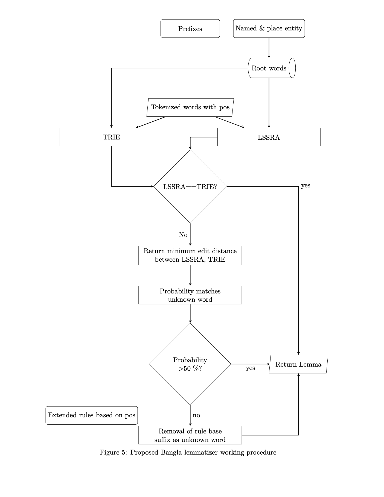

# KULemma

A Bangla lemmatizer developed by DGTED Lab, Khulna University.

## Paper Link

[KULemma_Towards_a_Comprehensive_Bangla_Lemmatizer](https://www.researchgate.net/publication/380828383_KULemma_Towards_a_Comprehensive_Bangla_Lemmatizer)

*Accuracy*: 96.90.

### Development Steps:
- Compiling lingual resources.
- Designing algorithms.
- Assembling stemming rules.
- Implementing lemmatizer.

*Note*: Dataset, code and installation package will provide soon.
